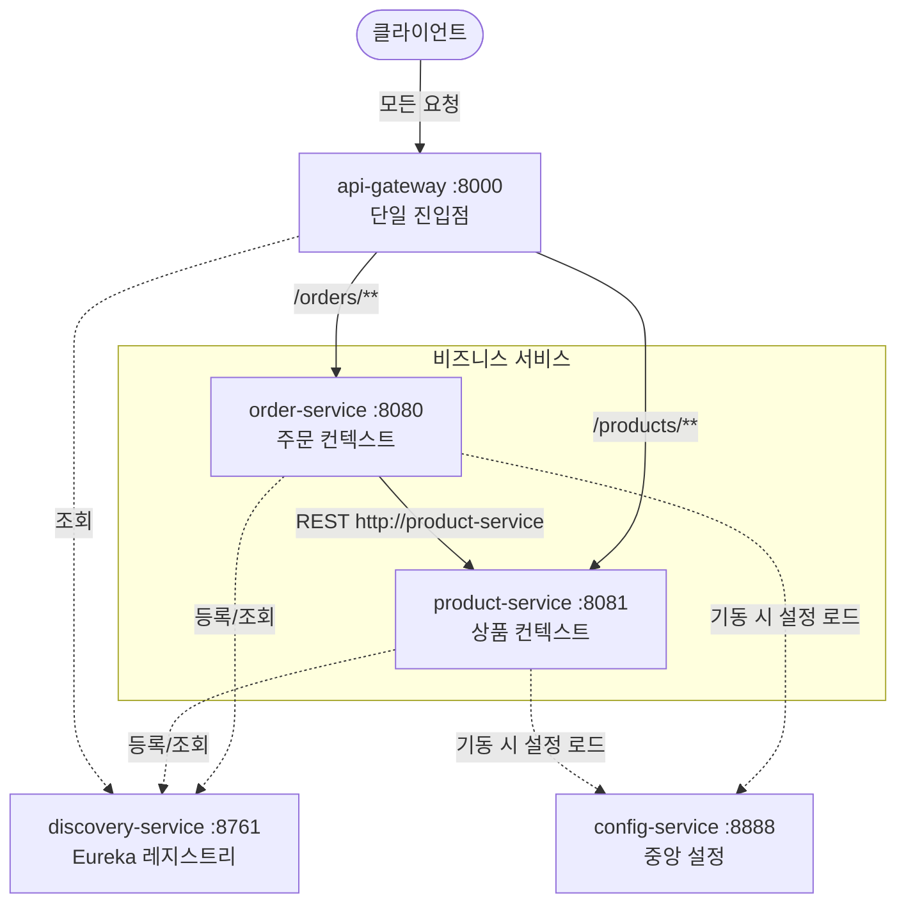

# MSA + DDD 예제 프로젝트

MSA(마이크로서비스 아키텍처)와 DDD(도메인 주도 설계)의 구조를 보여주기 위한 최소 예제입니다.
아키텍처 학습이 목적이므로 DB 대신 **인메모리 저장소**를 사용합니다.

## 서비스 구성

| 서비스 | 포트 | 역할 |
|---|---|---|
| **discovery-service** | 8761 | 서비스 디스커버리 (Eureka Server). 서비스들의 위치 레지스트리 |
| **config-service** | 8888 | 중앙 설정 서버 (Spring Cloud Config). 설정을 한 곳에서 관리 |
| **api-gateway** | 8000 | 단일 진입점 (Spring Cloud Gateway). 경로 기반 라우팅 |
| **order-service** | 8080 | 주문 바운디드 컨텍스트 (비즈니스 서비스) |
| **product-service** | 8081 | 상품 바운디드 컨텍스트 (비즈니스 서비스) |

## 전체 구조 (MSA 관점)



### 인프라 서비스가 하는 일

**api-gateway (단일 진입점)**
- 클라이언트는 `:8000` 하나만 알면 된다. 내부 서비스 포트는 외부에 노출되지 않는다.
- `/orders/**` → order-service, `/products/**` → product-service로 경로 기반 라우팅 ([application.yml](api-gateway/src/main/resources/application.yml)에 선언).
- `uri: lb://order-service` — Eureka에서 서비스 이름으로 인스턴스를 찾아 로드밸런싱.
- 실무에서는 여기서 JWT 인증, rate limiting, CORS 등 공통 관심사를 처리한다.

**discovery-service (Eureka)**
- 각 서비스가 기동 시 자기 위치(host:port)를 등록하고, 서로를 **서비스 이름**으로 찾는다.
- order-service의 product 호출 주소가 `http://localhost:8081` 하드코딩에서 `http://product-service`로 바뀌었다.
  `@LoadBalanced RestClient`([RestClientConfig.java](order-service/src/main/java/com/example/order/infrastructure/config/RestClientConfig.java))가 이름을 실제 주소로 변환한다.
- 인스턴스를 여러 개 띄우면 자동으로 클라이언트 사이드 로드밸런싱이 된다.
- 대시보드: http://localhost:8761 에서 등록된 서비스 확인 가능.

**config-service (중앙 설정)**
- 각 서비스는 기동 시 `spring.application.name`으로 자기 설정을 받아간다 (`spring.config.import: configserver:...`).
- 설정 파일 위치: [config-repo/](config-service/src/main/resources/config-repo/) — 예제라 classpath(native 모드)를 쓰지만 실무에서는 Git 저장소를 백엔드로 쓴다.
- 중앙 설정이 서비스 로컬 application.yml보다 우선한다. 확인: http://localhost:8888/order-service/default
- `optional:` 접두사를 붙여서 config-service가 꺼져 있어도 각 서비스가 로컬 설정으로 기동되게 했다 (예제 편의).

### MSA 핵심 포인트 (비즈니스 서비스)

- **서비스별 독립 프로젝트**: 각 서비스는 자기만의 빌드(`build.gradle`), 설정, 포트를 가진 독립 배포 단위입니다.
- **컨텍스트별 독립 모델**: `Money` 클래스가 양쪽에 중복으로 존재하는 것은 의도된 것입니다. 바운디드 컨텍스트끼리 모델(코드)을 공유하지 않습니다.
- **API로만 통신**: order-service는 product-service의 DB나 코드에 접근하지 않고 REST API로만 통신합니다.
- **데이터 스냅샷**: 주문 시점의 상품명/가격을 `OrderLine`에 복사해서 저장합니다. 이후 상품 정보가 바뀌어도 완료된 주문은 변하지 않습니다.

## 서비스 내부 구조 (DDD 레이어드 아키텍처)

비즈니스 서비스 둘 다 같은 4계층 구조입니다. 의존 방향은 항상 **도메인을 향해** 흐릅니다.

```
interfaces      → HTTP 요청/응답 변환만 담당 (Controller, DTO)
    ↓
application     → 유스케이스 흐름 조율 (ApplicationService, Command, Port 인터페이스)
    ↓
domain          → 비즈니스 규칙의 심장 (Aggregate, VO, Repository 인터페이스, Domain Event)
    ↑ (구현)
infrastructure  → 기술 어댑터 (인메모리 저장소, REST 클라이언트, 이벤트 발행 구현체)
```

핵심 원칙: **domain 계층은 어떤 계층에도, 어떤 프레임워크에도 의존하지 않습니다.**
`OrderRepository`, `ProductClient`, `DomainEventPublisher`는 모두 인터페이스(포트)이고,
구현체(어댑터)는 infrastructure에 있습니다. → 의존성 역전 원칙(DIP)

## DDD 개념 → 코드 매핑

| DDD 개념 | 파일 | 설명 |
|---|---|---|
| 애그리거트 루트 | `order/domain/model/Order.java` | 생성은 `Order.place()`로만, 상태 변경은 `cancel()` 등 메서드로만. 불변식을 내부에서 보장 |
| 애그리거트 내부 VO | `order/domain/model/OrderLine.java` | Order를 통해서만 접근. 단독 리포지토리 없음 |
| 값 객체 (VO) | `domain/model/Money.java` | 불변, 식별자 없음, 자가 검증 |
| 리포지토리 (포트) | `order/domain/repository/OrderRepository.java` | 인터페이스는 domain에, 구현은 infrastructure에 |
| 도메인 이벤트 | `order/domain/event/OrderPlacedEvent.java` | "주문 완료"라는 사실. 핸들러(`OrderEventHandler`)가 후속 처리를 분리 수행 |
| 응용 서비스 | `order/application/OrderApplicationService.java` | 유스케이스 흐름만 조율, 규칙은 도메인에 위임 |
| 출력 포트 / ACL | `order/application/port/ProductClient.java` | 외부 서비스 응답을 우리 모델(`ProductInfo`)로 번역 (부패 방지 계층) |
| 어댑터 | `order/infrastructure/client/ProductRestClient.java` | 포트의 HTTP 구현. gRPC/Kafka로 교체해도 유스케이스 코드는 불변 |

## 주문 흐름

`POST http://localhost:8000/orders` (게이트웨이 경유) 요청 시:

1. **api-gateway**가 `/orders/**` 규칙에 따라 Eureka에서 order-service 인스턴스를 찾아 전달
2. `OrderController`가 요청을 `PlaceOrderCommand`로 변환
3. `OrderApplicationService`가 `ProductClient` 포트로 상품 조회 + 재고 차감
   (Eureka에서 product-service를 찾아 HTTP 호출)
4. `Order.place()`로 애그리거트 생성 — 총액 계산, "주문 항목 1개 이상" 등 불변식 검증
5. `OrderRepository`에 저장
6. `OrderPlacedEvent` 발행 → `OrderEventHandler`가 수신해 후속 처리 (알림 등)

재고가 부족하면 product-service의 `Product.decreaseStock()`이 예외를 던져 주문이 실패합니다.
(실무에서는 이 지점에서 Saga 패턴 등으로 분산 트랜잭션/보상 처리를 설계합니다.)

## 실행 방법

Java 17+ 와 Gradle이 필요합니다. **기동 순서가 중요합니다** (인프라 → 비즈니스 → 게이트웨이):

```bash
# 1. 서비스 디스커버리 (가장 먼저)
cd discovery-service && gradle bootRun    # :8761

# 2. 중앙 설정 서버
cd config-service && gradle bootRun       # :8888

# 3. 비즈니스 서비스 (순서 무관)
cd product-service && gradle bootRun      # :8081
cd order-service && gradle bootRun        # :8080

# 4. API 게이트웨이
cd api-gateway && gradle bootRun          # :8000
```

기동 후 http://localhost:8761 에서 4개 서비스(GW, ORDER, PRODUCT)가 등록됐는지 확인하세요.
(Eureka 등록·전파에 최대 30초 정도 걸릴 수 있습니다.)

### API 테스트 (모두 게이트웨이 :8000 경유)

```bash
# 상품 조회
curl http://localhost:8000/products/1

# 주문 생성 (gateway → order-service → product-service 호출 발생)
curl -X POST http://localhost:8000/orders \
  -H "Content-Type: application/json" \
  -d '{"customerId": 1, "items": [{"productId": 1, "quantity": 2}, {"productId": 3, "quantity": 1}]}'

# 주문 조회 (위 응답의 orderId 사용)
curl http://localhost:8000/orders/{orderId}

# 재고 차감 확인
curl http://localhost:8000/products/1

# 중앙 설정 확인 (config-service가 order-service에 내려주는 설정)
curl http://localhost:8888/order-service/default
```

## 디렉터리 트리

```
MSA/
├── discovery-service/              # Eureka Server (:8761) - 서비스 레지스트리
├── config-service/                 # Config Server (:8888) - 중앙 설정
│   └── src/main/resources/config-repo/   # 서비스별 중앙 설정 파일 (실무에서는 Git)
├── api-gateway/                    # Spring Cloud Gateway (:8000) - 단일 진입점
├── order-service/                  # 주문 바운디드 컨텍스트 (:8080)
│   └── src/main/java/com/example/order/
│       ├── interfaces/api/         # OrderController, 요청/응답 DTO
│       ├── application/            # OrderApplicationService, PlaceOrderCommand,
│       │   └── port/               #   ProductClient (출력 포트)
│       ├── domain/
│       │   ├── model/              # Order(AR), OrderLine, Money, OrderStatus
│       │   ├── repository/         # OrderRepository (인터페이스)
│       │   └── event/              # OrderPlacedEvent, DomainEventPublisher (포트)
│       └── infrastructure/
│           ├── persistence/        # InMemoryOrderRepository (어댑터)
│           ├── client/             # ProductRestClient (어댑터)
│           ├── config/             # RestClientConfig (@LoadBalanced)
│           └── event/              # SpringDomainEventPublisher (어댑터)
└── product-service/                # 상품 바운디드 컨텍스트 (:8081)
    └── src/main/java/com/example/product/
        ├── interfaces/api/         # ProductController, DTO
        ├── application/            # ProductApplicationService
        ├── domain/
        │   ├── model/              # Product(AR), Money
        │   └── repository/         # ProductRepository (인터페이스)
        └── infrastructure/
            └── persistence/        # InMemoryProductRepository (어댑터)
```

## 실무로 확장한다면

- 인메모리 리포지토리 → JPA + 서비스별 독립 DB (Database per Service)
- Spring 내부 이벤트 → Kafka/RabbitMQ로 서비스 간 비동기 이벤트 발행
- 동기 재고 차감 → Saga 패턴(보상 트랜잭션)으로 분산 트랜잭션 처리
- Config Server native 모드 → Git 저장소 백엔드 + `/actuator/refresh`(또는 Spring Cloud Bus)로 무중단 설정 갱신
- Gateway에 인증(JWT/OAuth2), rate limiting, 서킷 브레이커(Resilience4j) 필터 추가
- 분산 추적(Micrometer Tracing + Zipkin), 중앙 로깅(ELK), 메트릭(Prometheus/Grafana)
# MSA_DDD_PROJECT

